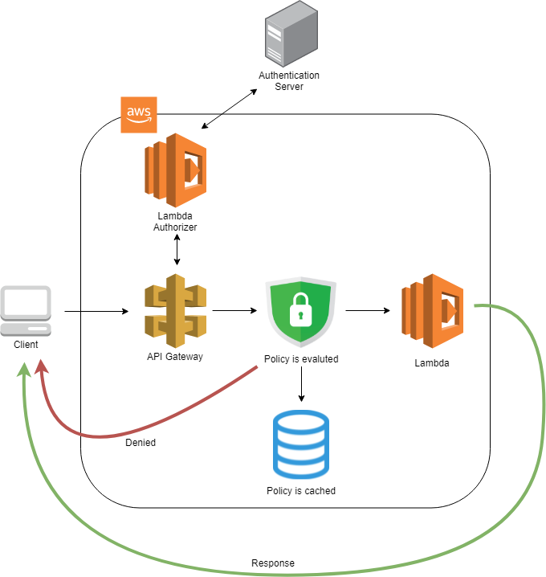

## Background
In this tutorial you will build a simple Typescript service running on AWS Lambda. It will also cover Lambda Authorizer and Serverless. 
In particular, we will only accept calls when checked against a separate authentication server.

### AWS Lambda
AWS Lambda is Amazon's offering for FaaS (Function as a Service). It is similar to Google Cloud Functions, Microsoft Azure Functions, and others. 

Instead of having a server that is constantly on you can have a function that is just invoked when you need it. It also scales automatically.

An example would be if you want to save images uploaded by your users to Amazon S3 but want to compress the images first, to save on storage. 
A Lambda function could receive a request, compress the image, save it, and return a response. No server required.

### Lambda Authorizer
All incoming requests are first sent to Amazon API Gateway. But you can specify that a request first need to be accepted by a Lambda Authorizer. 

A Lambda Authorizer is just another Lambda function that returns a policy. A policy is an object that specifies if the caller is allowed or denied to use certain resources.

The API Gateway can then cache the result. So if you are uploading a lot of images in bulk using the same API Key you only need to bother the authentication server once. 

### Serverless
AWS Lambdas and FaaS in general are examples of what is often called "serverless computing" and one way to handle deployment of those is to use the open source [Serverless Framework](https://www.serverless.com/). 
The configuration is specified using `.yaml` files and can be deployed directly from the terminal.

Serverless doesn't only work with AWS but also Azure, Google Cloud, and more.

### Project Overview
We will do the following things:
- Create AWS Lambda function
- Create another AWS Lambda function to be restricted to authorized calls
- Create a Lambda Authorizer talking to external "Authentication Server"
- Deploy using Serverless

This will be the infrastructure layout once we're done:

- A client can make a request that will be handled by Amazon API Gateway
- Policy will be evaluated by Lambda Authorizer and cached
  - If approved, request will go to the Lambda function
  - If denied, request will be rejected

### Issues
> Katacoda provides the ability to click a button to edit a file. I'm not sure if that is it but sometimes during testing I noticed that I got error messages that functions didn't exist when they had just been added to a file. It was resolved when manually editing the files a bit (e.g. adding and then removing a character). So try that if you come across any problems.
